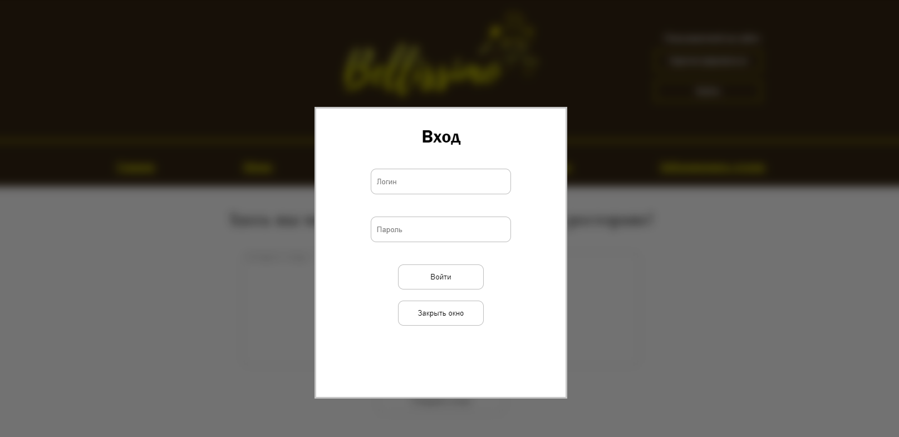

 

  <h3 align="center">Сайт ресторана итальянской кухни Bellissimo</h3>

  

    Данный проект был выполнен мной в рамках итогового проекта по дисциплине "Разработка и защита Web-приложений".
     
     
  

## О проекте

Данный проект представляет из себя сайт вымышленного ресторана Bellissimo

Приложение создано на чистом HTML, CSS и Javascript, а также при создании использовался PHP с фреймворком RedBeanPHP.

Сайт был размещен на беплатном хостинге, который предоставлял базу данных для работы на сайте.
С её помощью была реализована возможность авторизации, регистрации, а также оставления отзывов на сайте.

При помощи Javascript была создана верстка для экранов с меньшей шириной, а также для мобильных приложений.

